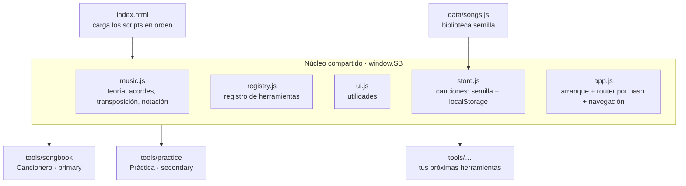

# Arquitectura de la app Cancionero

App **sin build**, JavaScript puro. Se abre directo (doble clic al `index.html` para
las vistas básicas) y, servida por http(s), se vuelve **PWA instalable y offline**.
Pensada para **crecer con sub-herramientas**: el cancionero es una, la práctica de
acordes es otra, y las que traigas después se enchufan igual.

## Piezas



- **`window.SB`** es el único global; todo cuelga de ahí (`SB.music`, `SB.registry`, `SB.store`, `SB.ui`).
- **Router por hash:** `#/<herramienta>/<resto>`. Ej.: `#/songbook`, `#/songbook/song/unchained-melody`, `#/practice`.
  El `resto` se lo pasa `app.js` a la herramienta; ella decide qué mostrar (deep-linking gratis).
- **Navegación automática:** `app.js` construye las pestañas (herramientas `primary`) y los botones
  pequeños (herramientas `secondary`) leyendo el registro. No hay que tocar el HTML de la barra.

## Cómo agregar una sub-herramienta nueva

1. Crea `tools/<mi-tool>/<mi-tool>.js` con esta forma mínima:

   ```js
   (function () {
     function mount(view, rest, ctx) {
       // 'view' es el <main> donde pintas; 'rest' es lo que sigue en la URL;
       // 'ctx.navigate("<tool>/<resto>")' cambia de vista.
       view.innerHTML = '<h1>Mi herramienta</h1>';
     }
     SB.registry.register({
       id: 'mi-tool',            // único, va en la URL
       name: 'Mi tool',          // etiqueta
       kind: 'secondary',        // 'primary' = pestaña · 'secondary' = botón pequeño
       icon: '<svg…>',           // opcional (solo para secondary)
       mount,                    // obligatorio
       onLeave() { /* limpieza opcional: detener audio/timers */ }
     });
   })();
   ```

2. Añade su `<script src="tools/mi-tool/mi-tool.js">` en `index.html` (antes de `core/app.js`).
3. Si quieres que funcione offline, agrégala al array `SHELL` de `sw.js` y sube el número de `CACHE`.

Eso es todo: aparece sola en la barra y es ruteable por `#/mi-tool`.

## Contrato de una herramienta

| Campo | Obligatorio | Qué es |
|---|---|---|
| `id` | sí | Identificador único (URL). |
| `name` | sí | Etiqueta visible. |
| `kind` | sí | `'primary'` (pestaña) o `'secondary'` (botón pequeño). |
| `icon` | no | SVG en línea, para las secundarias. |
| `mount(view, rest, ctx)` | sí | Pinta la herramienta en `view`. `ctx.navigate(path)` para moverse. |
| `onLeave()` | no | Se llama al salir de la herramienta (detener metrónomos, timers, audio). |

## Datos (canciones)

Modelo canónico en `data/songs.js`. La clave: **cada acorde se ancla a la posición de un
carácter** de la letra (`[pos, "acorde"]`), no "encima". Acordes en notación americana interna;
latino es solo presentación. Partes repetidas → `ref`. Partes de solo acordes → `grid`.

`store.js` sirve la semilla del repo y guarda las ediciones del usuario en `localStorage`.
En la Fase 4 (repo Git como base de datos) se cambia por `fetch` de JSON + commit vía API de
GitHub **sin tocar las herramientas**: la forma del dato no cambia.

## Correr en local

Las vistas básicas abren con doble clic (`index.html`). Para PWA/offline y para probar como
en producción, sírvelo:

```
cd app
python -m http.server 8000
# abrir http://localhost:8000
```

## Despliegue (GitHub Pages)

Publicada desde la rama `main` del repo `goyogramadors/cancionero`, **Pages source = rama `main`,
carpeta `/` (raíz)**. El `index.html` de la raíz del repo redirige a `app/`, así que el sitio queda
en `…/cancionero/` y la app en `…/cancionero/app/`. Todo usa rutas relativas, por eso funciona bajo
ese subpath. Cada `git push` a `main` republica el sitio.

> Nota: no se usó GitHub Actions porque el token de `gh` no tenía el scope `workflow`. Si más adelante
> se agrega ese permiso, el despliegue por Actions (servir `app/` en la raíz del sitio) es una mejora
> opcional; hay un workflow de ejemplo en el historial del chat.

Al cambiar archivos del shell, sube `CACHE` en `sw.js` (o confía en el *stale-while-revalidate*, que
refresca en la carga siguiente).

## Persistencia y sincronización

- **Local:** `core/store.js` guarda las ediciones del usuario en `localStorage` (funciona offline,
  sin cuenta). La semilla de ejemplo vive en `data/songs.js`.
- **Repo como base de datos:** `core/github.js` sube/baja todas las canciones del usuario a un único
  JSON del repo (`data/user-songs.json`) vía la API de contenidos de GitHub. La UI está en
  `tools/settings/`. Requiere un token fino con **Contents: Read and write**. Manual por ahora
  (botones Traer/Subir); el `store` no cambia su forma, así que evolucionar a per-archivo o
  auto-sync no toca las herramientas.
