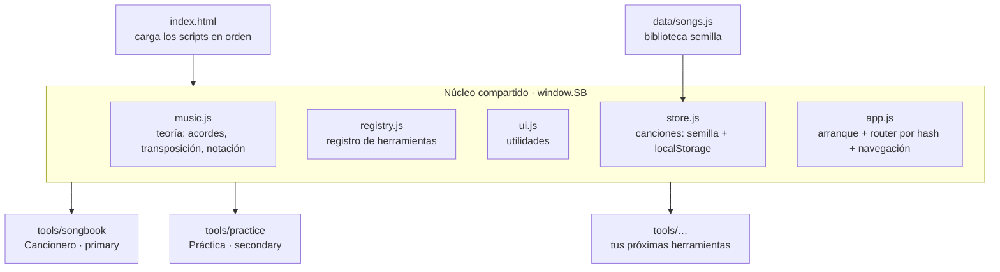

# Arquitectura de la app Cancionero

App **sin build**, JavaScript puro. Se abre directo (doble clic al `index.html` para
las vistas básicas) y, servida por http(s), se vuelve **PWA instalable y offline**.
Pensada para **crecer con sub-herramientas**: el cancionero es una, la práctica de
acordes es otra, y las que traigas después se enchufan igual.

## Piezas



- **`window.SB`** es el único global; todo cuelga de ahí (`SB.music`, `SB.registry`, `SB.store`, `SB.ui`).
- **Router por hash:** `#/<herramienta>/<resto>`. Ej.: `#/songbook`, `#/songbook/song/unchained-melody`, `#/practice`.
  El `resto` se lo pasa `app.js` a la herramienta; ella decide qué mostrar (deep-linking gratis).
- **Navegación automática:** `app.js` construye las pestañas (herramientas `primary`) y los botones
  pequeños (herramientas `secondary`) leyendo el registro. No hay que tocar el HTML de la barra.

## Cómo agregar una sub-herramienta nueva

1. Crea `tools/<mi-tool>/<mi-tool>.js` con esta forma mínima:

   ```js
   (function () {
     function mount(view, rest, ctx) {
       // 'view' es el <main> donde pintas; 'rest' es lo que sigue en la URL;
       // 'ctx.navigate("<tool>/<resto>")' cambia de vista.
       view.innerHTML = '<h1>Mi herramienta</h1>';
     }
     SB.registry.register({
       id: 'mi-tool',            // único, va en la URL
       name: 'Mi tool',          // etiqueta
       kind: 'secondary',        // 'primary' = pestaña · 'secondary' = botón pequeño
       icon: '<svg…>',           // opcional (solo para secondary)
       mount,                    // obligatorio
       onLeave() { /* limpieza opcional: detener audio/timers */ }
     });
   })();
   ```

2. Añade su `<script src="tools/mi-tool/mi-tool.js">` en `index.html` (antes de `core/app.js`).
3. Si quieres que funcione offline, agrégala al array `SHELL` de `sw.js` y sube el número de `CACHE`.

Eso es todo: aparece sola en la barra y es ruteable por `#/mi-tool`.

## Contrato de una herramienta

| Campo | Obligatorio | Qué es |
|---|---|---|
| `id` | sí | Identificador único (URL). |
| `name` | sí | Etiqueta visible. |
| `kind` | sí | `'primary'` (pestaña) o `'secondary'` (botón pequeño). |
| `icon` | no | SVG en línea, para las secundarias. |
| `mount(view, rest, ctx)` | sí | Pinta la herramienta en `view`. `ctx.navigate(path)` para moverse. |
| `onLeave()` | no | Se llama al salir de la herramienta (detener metrónomos, timers, audio). |

## Acordes (piano y guitarra)

Nada de diagramas escritos a mano: se **calculan**.
- **Piano:** `SB.music.pitchClasses(nombre)` → las teclas, desde la fórmula del acorde.
- **Guitarra:** `SB.music.guitarVoicings(nombre)` busca formas tocables sobre el diapasón (afinación
  EADGBE, ventana de 4 trastes, fundamental o bajo en la cuerda grave) y las ordena por comodidad.
  Cubre *cualquier* acorde. `SB.chords.getVoicings(nombre)` combina, en este orden: digitaciones
  **propias del usuario** → **curadas** (formas abiertas conocidas) → **generadas**. Memoizado.
- **Personalización** (`core/chords.js` + `tools/chords/`): el usuario agrega su propia digitación
  (patrón `x32010`) o define una **alteración desconocida** dando sus intervalos; ambas quedan en
  `localStorage` y se usan en todo el cancionero. `SB.music.registerFormulas` inyecta las fórmulas.
- **Render** (`core/diagrams.js`): `SB.diagrams.guitar(patrón, etiqueta)` y `SB.diagrams.piano(pcs)`.

## Canta (karaoke con afinación en vivo)

La herramienta más grande; sirve de ejemplo de una sub-herramienta con audio pesado. Piezas
(`tools/canta/`):

- **`canta.js`** — la herramienta (se registra como primaria): biblioteca de paquetes y pantalla de
  canto (canvas con carril de notas, letra palabra a palabra, puntaje). Todo el estado de partida
  (segmentos verde/rojo, racha, traza de la voz) vive aquí.
  **Cómo se puntúa:** una barra queda verde si acertaste (±`TOL` = 0.7 semitonos) durante al menos
  el `HITRATIO` (72 %) del tiempo *evaluado* de la nota. El tiempo evaluado excluye los primeros
  `TRANS` (150 ms, o el 35 % de la nota si es corta): cantar no es saltar entre plataformas, para
  llegar a una nota se pasa por las del medio, así que el ataque no suma ni castiga y se dibuja en
  gris en vez de rojo.
- **`canta-engine.js`** (`SB.cantaEngine`) — paquetes y transporte. Dos pistas (voz/música) con
  ganancia independiente. **Tono y velocidad se pre-renderizan** (no en tiempo real): al cambiarlos
  se procesa el audio completo y se retoma donde iba. Convención clave: **todas las posiciones son
  segundos de la canción original**; el audio renderizado dura `D/tempo` y se convierte al dibujar.
- **`canta-dsp.js`** — WSOLA (time-stretch) + remuestreo Hermite. Doble uso: Worker (camino normal)
  o `<script>` clásico (respaldo file://). Estira por `ρ/τ` y remuestrea por `ρ = 2^(semitonos/12)`.
- **`canta-pitch.js`** (`SB.cantaPitch`) + **`canta-pitch-worklet.js`** — captura del micrófono
  (getUserMedia sin echoCancellation/noiseSuppression, que matan el canto) y detección YIN en un
  AudioWorklet (decimación ×3). El estabilizador (compuerta de ruido adaptativa, mediana,
  anti-octava, retención) vive en `canta-pitch.js`; el modo Prueba genera el pitch desde la melodía.

- **`canta-motor.js`** (`SB.cantaMotor`) — puente con el **motor local** (`canta-prep/motor.py`), que
  hace lo que el navegador no puede: bajar de YouTube, separar la voz, transcribir. El motor **sirve
  la app en su mismo puerto** (8765), así que la API se pide en relativo (`api/estado`) y no hay CORS
  ni contenido mixto; si la app se abrió con otro servidor local se prueba `127.0.0.1:8765`. Sin
  motor (sitio publicado) la herramienta lo detecta y explica qué hacer, sin romperse. El motor
  también **publica el paquete al repo con git** (`POST api/publicar`), que es más simple y sin
  límites de tamaño que subirlo por la API de GitHub desde el navegador.

**Paquetes:** carpeta `canta-media/<id>/` con `vocals.m4a`, `music.m4a` y `canta.json`
(`{version,id,title,artist,youtube,duration,key,lang,files,lines:[{s,e,text,words:[{s,e,w}]}],`
`notes:[{s,e,m}],f0:{dt,v}}` — tiempos en segundos, `m` = nota MIDI). Los produce `canta-prep/`
(Python: yt-dlp + Demucs + faster-whisper + pyin). La carpeta está **gitignoreada** para que un
`git add -A` no suba cientos de MB por accidente; los paquetes que el usuario decide publicar se
agregan con `git add -f` desde el motor, y una vez trackeados se versionan normal. La app los carga
del servidor/sitio (`canta-media/index.json`), de una carpeta elegida por el usuario (quedan en
IndexedDB) o genera una **demo sintética**.

## Canta para alumnos (sitio satélite, repo aparte)

**https://goyogramadors.github.io/canta/** es un sitio en **otro repo**
(`goyogramadors/canta`) que muestra **solo** la herramienta Canta con
**solo** un subconjunto de ejercicios — pensado para compartir con alumnos
sin exponerles el cancionero personal (canciones propias) ni los controles
de mantenimiento (preparar canción, elegir carpeta, demo), que son para el
dueño de este repo.

Es un repo aparte, y no uno más liviano dentro de `cancionero`, a propósito:
GitHub Pages ata la ruta al nombre del repo (`goyogramadors.github.io/<repo>/`),
así que la única forma de que la URL pública sea `.../canta/` en vez de
`.../cancionero/canta/` es que "canta" sea su propio repo. Beneficio extra:
son árboles de URL completamente separados, así que truncar cualquiera de
las dos direcciones nunca lleva a la otra (con el sitio satélite colgando de
`/cancionero/canta/`, cortar el último tramo llevaba al cancionero personal).

No es un fork ni una copia: `goyogramadors/canta` es solo un caparazón
(`index.html` + `manifest.webmanifest` + `sw.js`) que reusa el mismo `core/`
y los mismos `tools/canta/*.js` y `canta-media/` de este repo por **ruta
absoluta** (`/cancionero/app/...`) — mismo origen `goyogramadors.github.io`,
sin CORS, sin duplicar código ni audios. Antes de cargar
`canta-engine.js`/`canta-pitch.js`, su `index.html` fija tres globales que
esos archivos leen (con el comportamiento de siempre si no están definidos):

- `SB_CANTA_MEDIA_BASE` — de dónde salen `index.json` y los paquetes
  (`'/cancionero/app/canta-media/'` en vez del default `'canta-media/'`).
- `SB_CANTA_WORKLET_URL` — ruta al AudioWorklet del pitch-detector, misma idea.
- `SB_CANTA_ALLOW` — lista blanca de ids: `fetchServerList()` filtra el
  índice a solo esos paquetes.
- `SB_CANTA_STUDENT` — que `canta.js` lee para **no pintar** la sección
  "Preparar una canción" ni los botones "Elegir carpeta…"/"Probar la demo".

Tiene su propio `manifest.webmanifest` (nombre "Canta", instalable aparte de
la PWA principal) y su propio `sw.js` (mismo patrón *stale-while-revalidate*
+ red-primero para `canta-media/` que `app/sw.js`, cache `canta-vN`).

**Para agregar o sacar un ejercicio de este sitio:** edita el array
`SB_CANTA_ALLOW` en `index.html` del repo `goyogramadors/canta` con los ids
de `app/canta-media/index.json`. No hace falta tocar nada más (el paquete
real vive en `app/canta-media/` de este repo, preparado con `canta-prep/`
como cualquier otro; un ejercicio nuevo aparece ahí solo al republicar
*este* repo — el sitio de Canta puede necesitar un rato más, o un push
propio, para verlo).

## Datos (canciones)

Modelo canónico en `data/songs.js`. La clave: **cada acorde se ancla a la posición de un
carácter** de la letra (`[pos, "acorde"]`), no "encima". Acordes en notación americana interna;
latino es solo presentación. Partes repetidas → `ref`. Partes de solo acordes → `grid`.

**Marcas de tiempo del karaoke.** Una línea preparada con Canta lleva además `t: [inicio, fin]`
(segundos) y `w: [[inicio, fin, posCarácter], …]` con el tiempo de cada palabra. Se anclan **a la
posición del carácter, igual que los acordes**, y por eso el editor las mueve con el mismo
mecanismo: partir con Enter reparte las marcas entre las dos líneas, unir con Retroceso las
concatena corridas, y al escribir se recalculan comparando prefijo y sufijo comunes
(`remapAnchors` en `tools/songbook/songbook.js`). Resultado: **editar la letra no desincroniza el
karaoke**. La canción guarda `cantaId` para saber a qué paquete corresponde; Canta prefiere
siempre la letra del Cancionero (la corregida) sobre la del paquete, y le pone tiempo a las
palabras nuevas interpolando entre las marcas vecinas.

`store.js` sirve la semilla del repo y guarda las ediciones del usuario en `localStorage`.
En la Fase 4 (repo Git como base de datos) se cambia por `fetch` de JSON + commit vía API de
GitHub **sin tocar las herramientas**: la forma del dato no cambia.

## Correr en local

Las vistas básicas abren con doble clic (`index.html`). Para PWA/offline y para probar como
en producción, sírvelo:

```
cd app
python -m http.server 8000
# abrir http://localhost:8000
```

## Despliegue (GitHub Pages)

Publicada desde la rama `main` del repo `goyogramadors/cancionero`, **Pages source = rama `main`,
carpeta `/` (raíz)**. El `index.html` de la raíz del repo redirige a `app/`, así que el sitio queda
en `…/cancionero/` y la app en `…/cancionero/app/`. Todo usa rutas relativas, por eso funciona bajo
ese subpath. Cada `git push` a `main` republica el sitio.

El sitio "Canta para alumnos" (más abajo) vive en **otro repo** (`goyogramadors/canta`), publicado
igual por GitHub Pages desde su propia rama `main`; consume los archivos de este repo por URL
absoluta, así que un cambio aquí puede necesitar que ese otro repo también republique (o simplemente
esperar a que su caché/SW se refresque) para verse reflejado ahí.

> Nota: no se usó GitHub Actions porque el token de `gh` no tenía el scope `workflow`. Si más adelante
> se agrega ese permiso, el despliegue por Actions (servir `app/` en la raíz del sitio) es una mejora
> opcional; hay un workflow de ejemplo en el historial del chat.

Al cambiar archivos del shell, sube `CACHE` en `sw.js` (o confía en el *stale-while-revalidate*, que
refresca en la carga siguiente).

## Persistencia y sincronización

- **Local:** `core/store.js` guarda las ediciones del usuario en `localStorage` (funciona offline,
  sin cuenta). La semilla de ejemplo vive en `data/songs.js`.
- **Repo como base de datos:** `core/github.js` sube/baja todas las canciones del usuario a un único
  JSON del repo (`data/user-songs.json`) vía la API de contenidos de GitHub. La UI está en
  `tools/settings/`. Requiere un token fino con **Contents: Read and write**. Manual por ahora
  (botones Traer/Subir); el `store` no cambia su forma, así que evolucionar a per-archivo o
  auto-sync no toca las herramientas.
- **Publicar plataformas de Canta:** las plataformas corregidas a mano viven en `localStorage`
  (por dispositivo). "Traer/Subir" las lleva a `data/user-songs.json`, pero eso solo lo ven los
  aparatos con el mismo token. Para que las vea **cualquiera** (incluido el sitio de alumnos), el
  editor tiene **"Publicar para todos"**: con el mismo token de Ajustes, `SB.github.getFile`/`putFile`
  reescriben `app/canta-media/<id>/canta.json` (notes/f0/detector y `melodias[detector].notes`,
  igual que `setMelodia()`) y se borra la copia local. Solo aparece en el sitio del dueño
  (`!SB_CANTA_STUDENT` y con `core/github.js` cargado).
- **Editor de plataformas — selección múltiple:** `S.sel` es la lista de elegidas (`S.selNota` = la
  última, la que muestra agarraderas cuando hay una sola). Ctrl/⌘+clic o el modo `S.multiSel`
  (botón "Varias", para pantallas táctiles) suma/quita; con más de una, `edPointerDown` arma un
  arrastre `tipo:'grupo'` que aplica el mismo Δt (frenado para que la primera no pase de 0) y el
  mismo Δ de semitonos enteros a todas, **sin tono de órgano**. Copiar guarda en `PORTAPAPELES`
  (memoria de la página) las elegidas relativas a la primera; Pegar las crea desde
  `E().position()` y las deja elegidas. Todo pasa por `empujarDeshacer()`.
- **Token en varios dispositivos:** el token vive en `localStorage` (por dispositivo) y el repo es
  público, así que no puede ir en claro. Ajustes → "Usar el token en otros dispositivos" guarda la
  configuración completa en `data/token.enc.json`, cifrada con AES-GCM-256 y clave derivada de una
  contraseña (PBKDF2-SHA256, 600.000 iteraciones, mínimo 16 caracteres). En un dispositivo nuevo,
  "Desbloquear" lee ese archivo **sin token** (API pública) y lo descifra localmente. La contraseña
  nunca sale del navegador; la seguridad depende de su largo, porque el archivo es público.
